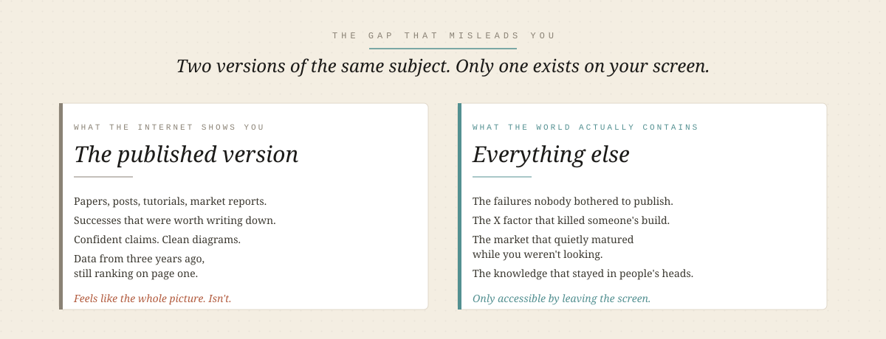
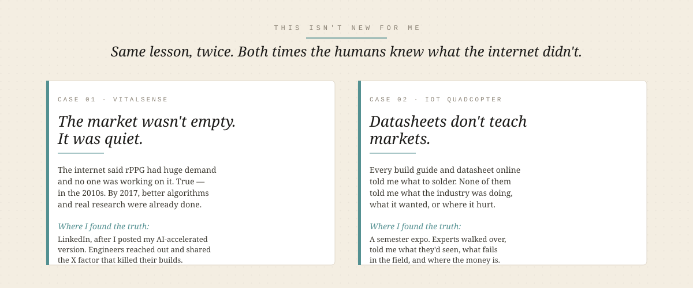
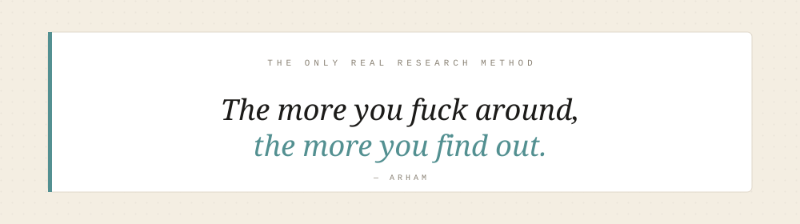

  

# The Internet Is Incomplete

> A belief I paid real time to learn.
> Incomplete information is more dangerous than none at all — because it feels like knowing.

Having no information about a subject is uncomfortable. You feel it. You know you don't know, so you're careful. You ask. You go slow.

Having *incomplete* information is worse, because it feels like knowing. You read three articles, watch a couple of videos, skim a report, and you walk out of the browser convinced you understand the shape of a thing. You act on that shape. You commit weeks, sometimes months. And the missing piece — the one that would have changed everything — was never on any of the pages you found. Not because it's secret. Just because nobody bothered to write it down.

This is the failure mode I keep running into. Not once. Not in one domain. Repeatedly, across everything I've tried to learn about seriously.

I want to name it here, honestly, so I stop falling for it and so you can see it coming.

  

---

## Where I hit this hardest recently

The freshest version of this lesson is the two months I spent walking markets in Mirpurkhas, Hyderabad, and Karachi for my startup. Petroleum, petrol pumps, banks, telecom towers, hospitals. Every one of those markets looked one way on the internet and another way in person. Four of them turned out to be closed doors that no article told me were closed. One turned out to be open, but I only learned *why* it was open by standing inside it.

I've written that whole story in [`playbooks/starting-a-startup.md`](../playbooks/starting-a-startup.md) — the phases, the markets, what worked, what didn't. This piece isn't about the startup. It's about the deeper thing the startup taught me. And the startup wasn't the first time.

---

## This isn't new for me

  

### VitalSense

Before the startup, there was VitalSense — a contactless health monitoring project using rPPG. When I started researching it, the internet felt electric. Article after article told me rPPG had huge unmet demand, that almost no one was working on it, that this was open territory. I got excited. I started building.

What I didn't realize until much later was that all of those articles were true — *in the 2010s*. By 2017, real research had already moved through the field. Better algorithms had already been published. What looked like an empty market on my screen was actually a mature one whose activity had just slowed down enough to stop generating fresh SEO-friendly posts. Google's front page hadn't caught up.

I only figured this out when I did something the internet couldn't help me with: I built my AI-accelerated version, posted it on LinkedIn, and let real humans respond. Engineers I'd never met reached out. They told me about their own rPPG builds — some finished, some abandoned. They shared research the search results had never surfaced. One person told me the exact X factor that had killed their pipeline, a specific real-world condition, and it wasn't in any paper I had found in weeks of desk research. It was in that person's head, and it took a LinkedIn comment to get it out.

That was the moment I understood: the internet had shown me the marketing version of the field. The engineers held the *engineering* version. And the only way to reach it was to become visible enough that they'd talk to me.

### The IoT quadcopter

The quadcopter — STM32, embedded C, IoT-linked — was the same lesson in a different key. The internet is *full* of quadcopter content. Build guides, datasheets, forum threads, YouTube channels dedicated to nothing else. I could tell you how to solder every joint from memory. What none of that content could tell me was how the *industry* actually worked. What people were paying for. What was already solved commercially. Where the real hard problems lived. What was hype and what wasn't.

I got the answer to those questions at a semester expo. Multiple experts walked over to my project, and for the first time I heard someone say out loud: *"we tried that, here's what happened."* One conversation gave me more market clarity than months of tutorials. Not because those experts were smarter than the internet — they weren't. It's just that the things they knew had never been *worth writing down* in a form Google could rank.

### The pattern

Both projects followed the same arc. Internet said one thing. I built assuming that thing was true. Real humans, in real rooms or real replies, told me the other 40% of the story that my screen had never contained.

If it happened once, it's an anecdote. Twice is a pattern. The startup made it three. I stopped calling it bad luck.

---

## Why the internet is structured to be incomplete

I used to think this was about laziness — that if I just searched better, dug deeper, opened more tabs, I could get past it. That's wrong. The gap is structural. A few reasons the internet is built to leave things out:

- **Successes get published. Failures don't.** The person who tried your idea and failed doesn't write a blog post about it. They move on. Their knowledge stays in their head, or at best in a private conversation. The version of a field you can Google is disproportionately the version that *worked*.
- **What's old stays visible. What's current stays quiet.** Search rankings favor articles that have accumulated links over years. That means the loudest voice in a search result is often three to seven years old. A field can mature completely and you'd never know from page one.
- **Tacit knowledge doesn't compress into a post.** The most valuable thing an expert knows is usually the thing they can't articulate cleanly — the intuition from a hundred failures, the smell of a bad market, the reason a datasheet lies. That kind of knowing only transfers in person, in real time, in response to your specific question.
- **Local context is invisible to global platforms.** The internet is largely written from and for a few big markets. If your subject lives in Pakistan — load-shedding realities, Urdu-first users, factory-floor economics — a huge amount of what's true about it will never be posted anywhere, in any language, ever.

Any one of these would create gaps. All four together mean the internet is not a research tool for anything that touches the real world. It's a *starting hypothesis generator*. Nothing more.

---

## What to do instead

Don't sit with your laptop or your phone thinking that if you scroll long enough you'll find the complete picture. It's not there. Not because you haven't looked hard enough — because it was never posted.

Get up. Leave the comfort zone. Talk to people.

Post your ugly work publicly and let the experts come to you. LinkedIn, X, Instagram, a group chat, an expo, a conference stall, a WhatsApp community — the surface doesn't matter, the visibility does. Every one of my breakthroughs on incomplete-internet problems came from a real human filling in what the screen couldn't.

Go where the subject lives. Walk into the market. Visit the factory. Stand at the barber shop. Attend the expo you don't feel senior enough to attend. The people who hold the missing knowledge don't hand it out on request — they hand it out when they can see that you've already committed enough to be worth talking to.

Ask questions that force stories out. "What did you try that didn't work?" is worth ten questions of the "what would you recommend?" variety. Failure stories carry more information than success advice, and failure stories are exactly what the internet won't give you.

And accept that this will always cost time. Not "more efficient than research" time. *Different* time. You're not optimizing the search — you're switching from search to exposure. That switch is what the internet can't do for you.

  

Build the next thing.

— Arham
