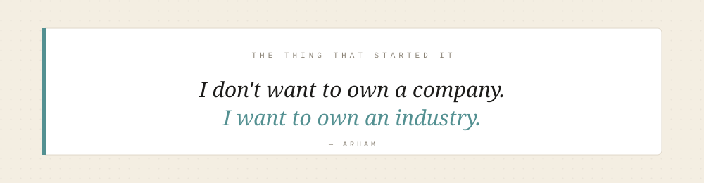
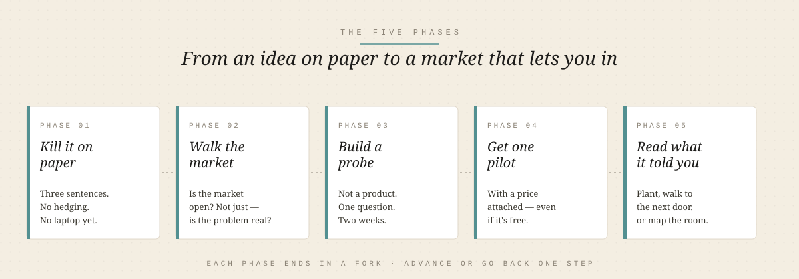
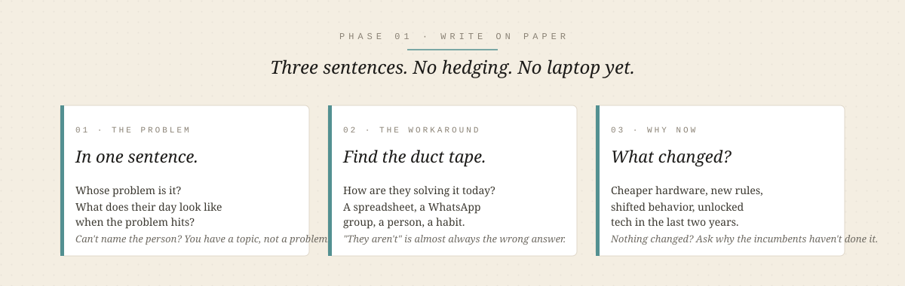
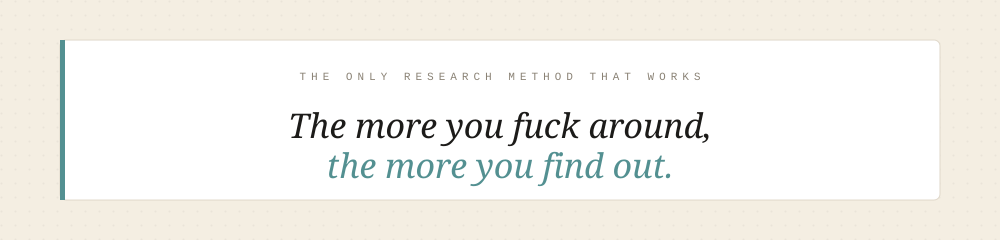
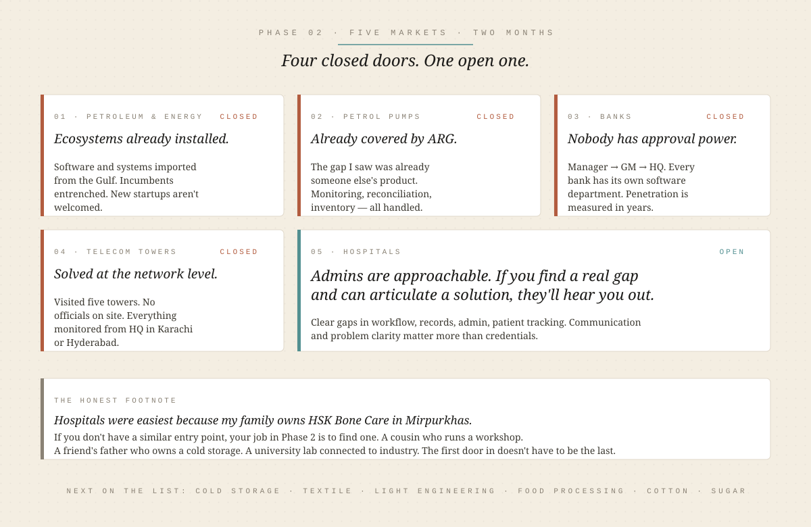
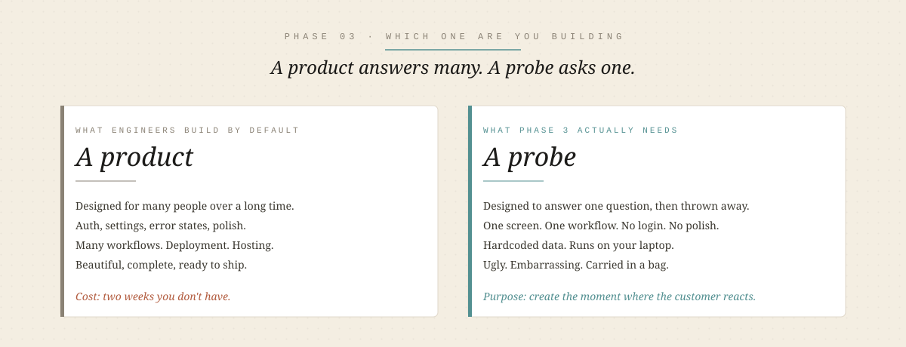
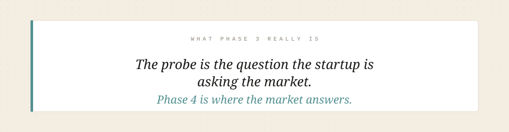
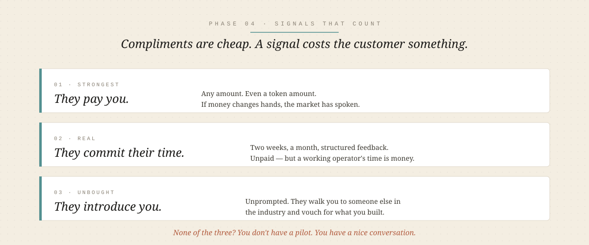
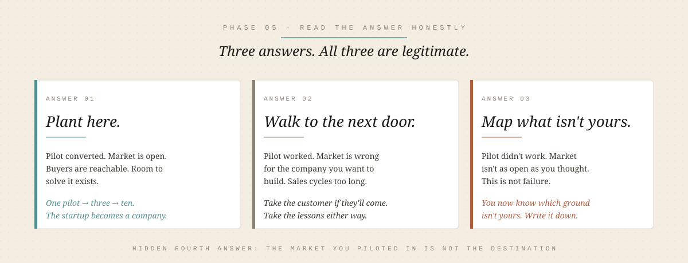

  

# Starting a Startup

> A playbook for engineers who want to build a company, written from two months in — not from the finish line.
> The phases don't change. The market you land in does.

  

That's the sentence I keep coming back to when the days get long. It's why I left the safety of "just build cool things" and started walking into factories, hospitals, petrol pumps, and bank branches with a notebook and a lot of questions. It's why I applied to NIC. It's why I'm writing this instead of shipping another side project.

Two months in, I've explored five markets across Mirpurkhas, Hyderabad, and Karachi. Three of them looked promising on the internet and turned out to be closed doors in person. One was easy because my family owns the business. One taught me the pattern I should have started with.

This piece is the pattern.

It's written for the engineer who has an idea, an itch, and no business background — the person I was eight weeks ago. If school taught you circuits and compilers but never taught you how a market actually decides whether to let you in, this is for you.

Two things to know before you read:

**One.** I'm not at the finish line. I don't have a funded company or a scaled pilot. I have a method that I paid two months to learn, and I'd rather write it down now while the bruises are fresh than wait until the story gets polished by hindsight.

**Two.** The engineer's instinct is to *build*. The startup's requirement is to *validate*. Those two things pull in opposite directions, and most engineer-founders lose the first year to that tension without naming it. I'll name it in every phase.

  

---

## Phase 1 — Kill the idea on paper before it kills your time

**Goal:** Write the idea down in a way that can be attacked. If it survives the attack, it earns the next phase. If it doesn't, you just saved yourself two months.

Every engineer I know — including me — has skipped this phase at least once. The pattern is always the same. You get excited. You open a laptop. You start Googling the market, reading Medium posts, scrolling LinkedIn for "state of the industry" reports, watching YouTube explainers. Three days later you have forty tabs open and a strong feeling that you understand the space.

You don't. You understand what the internet *chose to publish* about the space. That's a very different thing.

> The internet is not a research tool for this phase. It's a confidence generator. And confidence without contact with reality is the most expensive thing an early founder can carry.

I lost real weeks to this. I'll write about it properly in [`philosophies/internet-is-incomplete.md`](../philosophies/internet-is-incomplete.md) — for this phase, just know that anything you learn from a screen about a market you've never walked into is a starting hypothesis, not a fact.

So what do you do instead?

**Write three things on paper.** Not a doc. Not a Notion page. Paper, because paper doesn't let you edit your way out of a bad answer.

  

That's it. Three sentences.

> **Fork:** Can you write all three without hedging?
> **Yes →** Go to Phase 2.
> **No →** Don't open the laptop. The gap is that you don't know the person yet. Find one and talk to them before you write another word.

The engineer's version of failure at this phase is *building a prototype to figure out the problem*. Don't. A prototype answers "can I build this." Phase 1 answers "should anyone care." Those are different questions and they need different tools. The tool for Phase 1 is a conversation.

One more thing. If your three sentences all sound like a pitch — "AI-powered platform for X" — you're still in marketing mode. Rewrite them as if you're describing a friend's problem to another friend. Boring language is a good sign here.

---

## Phase 2 — Walk the market before you build for it

**Goal:** Find out whether the market is *open* to a new startup — not just whether the problem exists. A real problem in a closed market is still a dead startup.

  

Phase 1 gave you three sentences on paper. Phase 2 tests them against the world.

The engineer's instinct here is to survey. Build a Google Form, post it in three WhatsApp groups, wait for responses. Don't. Surveys measure what people are willing to *type*, not what they're willing to *pay for*. The only data that matters at this phase comes from being in the room with the person who has the problem.

So you walk. Literally. You go to the place where the problem lives — the factory floor, the hospital admin office, the petrol pump at 11pm, the bank branch on a Monday morning — and you ask questions until you understand two things:

1. **Is the problem real?** (Almost always: yes, in some form.)
2. **Is this market open to someone like you solving it?** (Much more often: no.)

The second question is the one nobody talks about, and it's the one that killed most of my first two months.

Here's what I mean. In eight weeks I walked five markets in Mirpurkhas, Hyderabad, and Karachi. Every one of them had real problems. Only one was open.

  

Read that carefully. Four out of five markets had the *problem* — what they didn't have was *room* for a new outside player. That's the distinction that took me two months to internalize.

There's one more thing I have to say honestly, because the piece falls apart without it. Hospitals were the easiest for me because my family owns one (HSK Bone Care, Mirpurkhas). I didn't crack the hospital market through skill. I walked in through a door that was already open. That doesn't invalidate the lesson — hospitals *are* structurally more open than banks — but I want you to know I had an unfair starting point, and if you don't have a similar entry point, your job in Phase 2 is to find one. A cousin who runs a workshop. A friend's father who owns a cold storage. A university lab connected to an industry. The first door in doesn't have to be the market you end up in, but you need *a* first door.

**How to read a market for openness:**

- **Who buys?** One person, or a committee? If it's a committee that stretches to headquarters in another city, walk away.
- **What's already installed?** If the ecosystem is entrenched and imported, you're not selling a product — you're selling a rip-and-replace, and nobody wants that from a two-month-old startup.
- **How does the industry treat new vendors?** Ask this directly. "When was the last time you brought in a new supplier or software provider?" If the answer is "years ago" or "we don't," that's your answer.
- **Is there someone with approval power in the room?** In hospitals, the admin often has it. In banks, nobody does. This single question predicts more about your first year than any market-size chart on the internet.

> **Fork:** After walking three to five markets, do you have at least one where (a) the problem is real, (b) buyers exist locally, and (c) someone in the room can say yes?
> **Yes →** Go to Phase 3. That's your market.
> **No →** Keep walking. Next on my list: cold storages, textile, light engineering, food processing, cotton factories, sugar mills. Yours will be different. Don't skip this phase — a closed market will burn the next twelve months of your life whether the problem is real or not.

The engineer's version of failure at this phase is *falling in love with the problem instead of the market*. A beautiful problem in a closed market is a research paper, not a startup. Save it for later. Right now you're looking for the market that will *let you in*.

---

## Phase 3 — Build the smallest thing that proves the problem is real

**Goal:** Build a thing that answers one question: *will this person, in this market, change their behavior because of what I made?* Nothing more. Nothing less.

This is the phase where engineers get dangerous to their own startup.

You've walked the market. You've found an open door. You know the problem is real and someone in the room can say yes. Your hands are itching. You want to open the editor, spin up the repo, pick the framework, design the schema, plan the architecture. Two weeks later you have a beautiful prototype that solves seven problems, and you go back to the customer and realize they only cared about one of them — and not the one you spent the most time on.

I've done this. Every engineer-founder I know has done this. It feels like progress and it isn't.

The trap has a name: **you're building a product when you should be building a probe.**

  

**What a probe looks like:**

- **Software:** one screen, one workflow, hardcoded data where possible, no login, no settings, no polish. If a hospital admin's problem is "I can't tell which patients missed follow-ups," your probe is a single page that lists them. Not a dashboard. Not a system. A list.
- **Hardware:** one function, breadboarded or 3D-printed, ugly, tethered to a laptop if it has to be. If the problem is "the machine doesn't warn us before it fails," your probe is one sensor and one buzzer. Not a product. A demonstration.
- **Hybrid (which is what I do):** the software half runs on your laptop, the hardware half is on a bench, and you carry both to the customer in a bag. That's fine. That's the point.

The clearest example of the probe method I've seen is this:

  <video src="../assets/barber-tool-probe-reel.mp4" controls width="100%"></video>

> If the video doesn't render on your device, [watch it here on Instagram](https://www.instagram.com/reel/DaERJJ8hQJh/).

A founder built a small convenience tool for barbers — the probe — then walked into nearby barber shops, handed it to them, and asked them to try it. His questions were the whole method: *do you like using it, would you buy it, and if yes, for how much.* Build the smallest thing. Carry it in a bag. Watch what happens when it touches a real hand. That's Phase 3 and the start of Phase 4 in one reel.

The probe has one job: **create a moment where the customer reacts.** Not "gives feedback." Not "provides input." *Reacts.* Their eyes change. They pick it up. They ask if they can show it to someone else. Or they don't, and their politeness tells you everything.

**How to scope a probe:**

1. **Pick the one workflow that hurts most.** Not the most interesting one. The most painful one. If you're not sure which it is, you didn't do enough of Phase 2 — go back.
2. **Strip everything that isn't that workflow.** No auth. No settings page. No admin panel. No "while we're at it." The urge to add "just one more thing" is the enemy.
3. **Set a hard time budget.** One to two weeks, maximum. If you can't probe the problem in two weeks, the probe is too big. Cut the scope, not the timeline.
4. **Build it so it can be shown, not shipped.** Local machine is fine. Manual data is fine. A demo video is fine if you can't get on-site. Deployment, hosting, and scaling are Phase 4 problems at earliest.

> **Fork:** Can you demo the probe to one real person in the market within two weeks?
> **Yes →** Build it. Go to Phase 4.
> **No →** The scope is wrong. Cut it in half. If it's still too big, cut it in half again. A probe you can't show in two weeks is a product you're building to avoid the harder work of showing it.

There's a specific failure mode worth naming here, because I keep almost falling into it. It's the moment you catch yourself thinking *"if I just add the login flow / the settings screen / the second workflow, then it'll be ready to show."* That thought is fear wearing an engineer's clothes. Showing an ugly probe to a real customer is scarier than building a polished thing alone in your room, so the brain finds reasons to keep building. Notice it. Name it. Ship the ugly thing anyway.

One more calibration. Your probe is allowed to embarrass you. It should embarrass you a little. If you look at it and think "I can't show them this," you're probably at the right level of polish. If you look at it and think "this is nearly a real product," you overbuilt.

  

---

## Phase 4 — Get one pilot, with a price attached

**Goal:** Get the probe into one real customer's hands in the market you picked, and walk out with a signal that has money — or a real commitment — attached to it. One pilot. Not five. Not "a few conversations." One.

Phase 3 ended with a question in your hand. Phase 4 is the answer.

Most engineer-founders stop at "they liked it." That's not an answer. That's a compliment. Pakistani business culture is polite by default — people will say nice things about your work to your face and then never call you back. Compliments are cheap. What you need is a signal that costs the customer something to give.

There are three signals that count. In order of strength:

  

If you can't get any of the three, you don't have a pilot. You have a nice conversation.

**How to run a pilot:**

1. **Pick one customer.** Not the biggest. Not the most impressive. The one who was most animated when they saw the probe in Phase 3. Animation is the closest thing to a real buying signal you'll get before money changes hands.
2. **Write the pilot on one page.** What you'll deliver, what they'll do, how long it runs, what "success" looks like at the end. One page. If it doesn't fit on one page, you're overcomplicating it — and if they can't read it in three minutes, they won't.
3. **Attach a price to the conversation, even if the pilot is free.** "This pilot is free for the next month. After that, the price will be X." That single sentence forces the customer to imagine paying. Their reaction — a wince, a shrug, a nod — is more valuable than anything they'll say about the product itself.
4. **Show up in person.** For the install. For the first use. For at least one follow-up. Remote pilots at this stage don't work — you'll miss the small frustrations that never make it into a message. The customer's silence around a broken button tells you more than their words around a working one.
5. **Set an end date.** Every pilot ends. At the end, you either convert it to a paying arrangement, extend it with a new commitment, or walk away with lessons. Open-ended pilots become free labor forever.

The founder in the barber reel did all five of these without naming them. He picked shops that showed interest. He handed them the tool with clear questions. He attached a price to the conversation — *"would you buy it, and for how much?"* — before anything was for sale. He showed up in person. And every conversation had a clear end.

Copy that pattern. It's not sophisticated. It's just honest.

> **Fork:** After the pilot ends, do you have a signal you didn't buy — money, real time committed, or an unsolicited introduction?
> **Yes →** Go to Phase 5.
> **No →** Do not build a bigger product. Do not add features. Go back to Phase 2 for this customer specifically — you missed something about what they actually need, or the market isn't as open as you thought. The pilot failing is not the startup failing. Building past a failed pilot *is* the startup failing.

The engineer's failure mode at this phase is *treating the pilot as a demo instead of a test.* A demo is designed to impress. A test is designed to find out. You want the pilot to reveal the ugly things — the workflow you missed, the constraint you didn't know about, the price they'd actually pay versus the price they said they'd pay. Impressing them is easy. Learning from them is the whole point.

One warning specific to our context. In Pakistan, and especially with family or community connections, people will do you favors. They will use your probe, praise it, and never intend to buy it. This is generous of them and dangerous to you. You have to be able to tell the difference between a signal and a favor. The clearest way: ask them, plainly, *"if I wasn't [Arham / your cousin / your friend's son], would you still pay for this?"* Watch their face before they answer. That's your signal.

---

## Phase 5 — Read what the market told you, then decide the ground

**Goal:** Turn one pilot's outcome into a decision about the *market*, not just the product. The pilot answered a small question. Phase 5 answers the big one: is this the ground I'm going to build on, or do I take what I learned and walk to a different market?

Most founders skip this phase because they're exhausted. The pilot worked, or it didn't, and either way the instinct is to charge forward — build the next feature, sign the next customer, raise the next round. Don't. This is the phase where you sit down and read what the market actually told you across all four phases before, and make a deliberate decision about where you're going to plant.

You've now walked several markets. You've probed one. You've piloted with one customer. You know things you couldn't have known two months ago. The question isn't "did this pilot succeed." The question is: **based on everything I now know, is this market the right ground for the company I'm trying to build?**

Three answers are possible. All three are legitimate.

  

**Answer 1: This is the ground. Plant here.**
The pilot converted or produced a strong signal. The market is open. The buyers are reachable. The problem is real and there's room for you to solve it. You now go from one pilot to three, then to ten, and the startup becomes a company. Phase 5 for you is short: pick this market, commit publicly, and start compounding.

**Answer 2: The pilot worked, but the market is wrong for the company you want to build.**
This is the hardest answer to accept, and the one most engineer-founders refuse to hear. One customer said yes — but the market above them is small, slow, or structurally hard to scale in. A hospital admin loved your probe, but you've realized the sales cycle for even mid-sized hospitals is nine months and every hospital wants heavy customization. You can build a consultancy here. You cannot build the industry you set out to build. Take the pilot, take the lessons, take the customer if they'll come — and walk to a market where the same problem exists at scale.

**Answer 3: The pilot didn't work, and the market told you something bigger than the pilot.**
This is the outcome nobody wants and everybody underestimates. The pilot failed *and* you now see, clearly, that the market itself isn't open in the way you'd hoped. This isn't failure. This is the two-month version of what took me eight weeks to see across five markets. You now know which ground *isn't* yours. That's real information. Write it down. It's what Phase 2 costs to learn from the inside.

**How to read the market's answer honestly:**

- **Look at the buyer, not the user.** The user liked it — did the *buyer* commit? In hospitals, the admin buys. In factories, the owner buys. If the person who loved your probe isn't the person who signs the check, you piloted with the wrong seat.
- **Count the doors.** How many similar customers exist within a day's travel from where you are right now? If the answer is "a few dozen" that's a business. If the answer is "three" that's a project. If the answer is "hundreds across cities you'd need to fly to" that's a company — but check your energy for the travel before you commit.
- **Check the ceiling.** If you succeeded fully in this market, how big does the company get? Not a spreadsheet projection — an honest estimate. Some markets top out early. If the ceiling is lower than the dream you started with, the market and the dream don't match.
- **Check the door you came in through.** Was it structural, or was it personal? If your first pilot happened because of a family connection or a friend, ask: can the next ten pilots happen the same way? If yes, good. If no, you need a repeatable way in, and finding that is a Phase 2 problem all over again.

> **Fork:** After honest reading, is this market the ground for the company you want to build over the next five years?
> **Yes →** Commit. Publicly. Tell people what you're building and who it's for. The next phase is not written here — it's the whole rest of the work.
> **No →** Take the lessons and walk to the next market. Not the next feature. The next market. You now have a method that shortens the two months to two weeks the next time.

There's one more thing I want to say here, because it's the reason I started this piece.

If your dream is small — one product, one company, one exit — you can stop reading and pick any of the three answers above and be fine. If your dream is bigger, the way mine is, then Phase 5 has a hidden fourth answer that only the founder can see: **the market you're piloting in is not the destination. It's the first door into a much bigger room.**

For me, that room is an industry. Not a company. Not a product. An industry — the kind where I'm not renting a seat, I'm building the room itself. Hospitals might be my first door. They probably aren't my last. Every market I walk teaches me something about how Pakistani industry actually works, and every pilot — successful or failed — is compounding into a map that I'll eventually use to build something none of the individual pilots could have predicted.

That's the frame. Every phase in this piece was a tool. The dream is what decides which tool to reach for and when.

Two months in, this is what I know:

- The internet lies by omission. Walk the market.
- Most markets are closed to new startups. Find the open ones.
- Build a probe, not a product.
- Pilots need a price signal, even when they're free.
- The pilot is not the point. The market is not the point. The industry you're building toward is the point.

Build the probe. Walk the market. Get the pilot. Read what it tells you. Then walk to the next door.

Build the next thing.

— Arham
